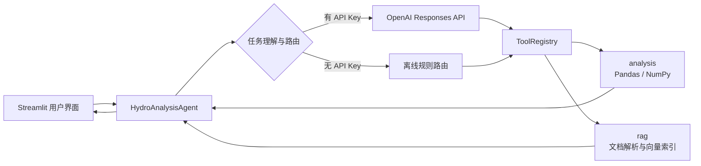
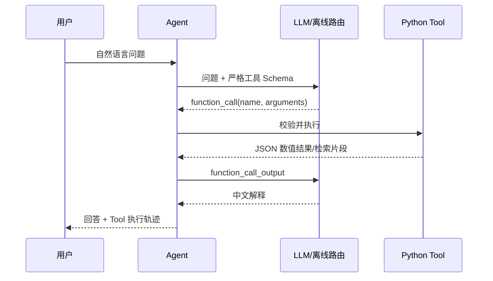
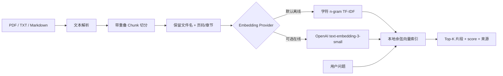
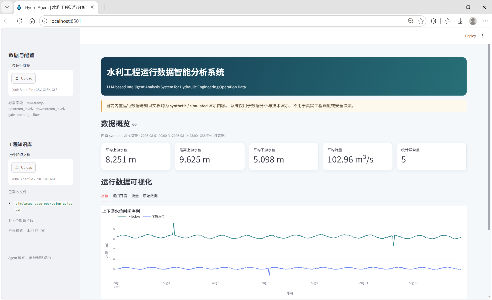
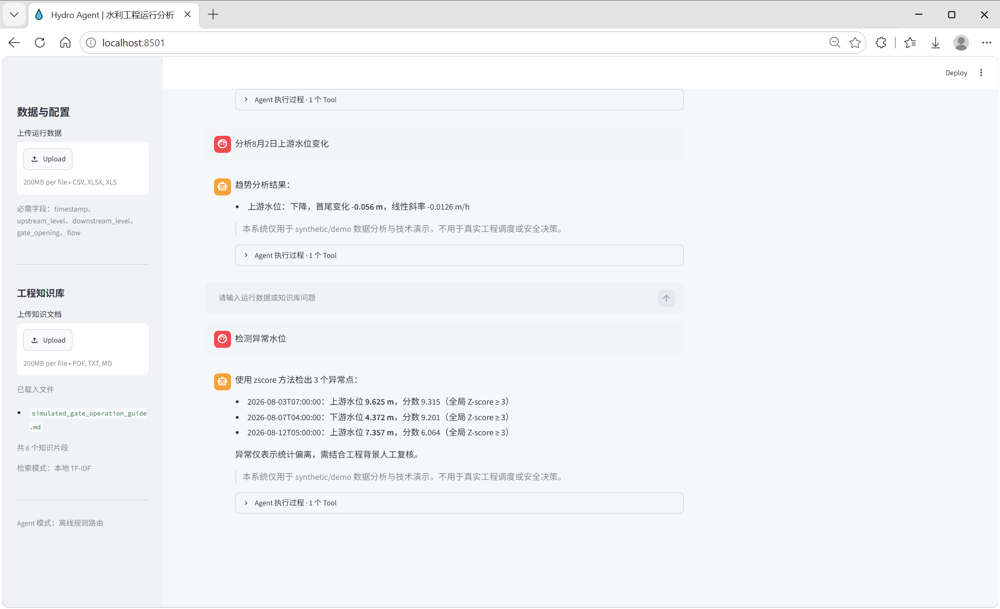
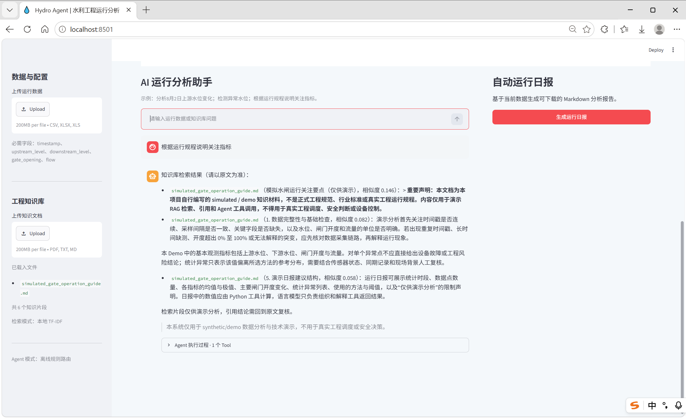
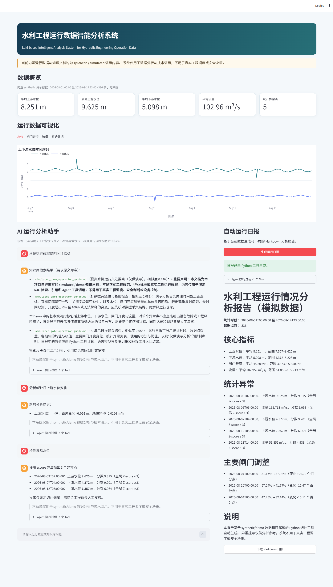

# Hydro Agent

**基于大语言模型的水利工程运行数据智能分析系统**  
LLM-based Intelligent Analysis System for Hydraulic Engineering Operation Data

一个面向 2027 届秋招简历与技术面试展示的个人 AI 应用。用户可以上传 CSV/Excel 运行数据，用中文提问；Agent 负责理解问题和选择工具，Pandas/NumPy 工具负责全部数值计算，本地 RAG 负责返回带文件名、页码或章节的知识片段。

> **安全与数据声明**：仓库内所有 Demo 运行数据均为 `synthetic / simulated`，不代表任何真实工程。内置知识文档也是自行编写的演示材料，不是正式规范。系统仅用于数据分析与技术演示，不用于真实工程调度、安全决策或基础设施控制。

## 项目背景

项目围绕水利工程专业背景构造一条完整但不过度设计的 AI 应用链路，重点展示：

- Python 工程数据分析与时序数据处理；
- LLM Tool / Function Calling 与多工具编排；
- PDF、TXT、Markdown 文档的本地 RAG；
- 可解释异常检测、相关性与闸门调整分析；
- Streamlit/Plotly Web 展示、pytest 测试与工程文档；
- Provider 解耦和无 API Key 的离线可演示能力。

## 主要功能

- 上传或直接使用 14 天、每小时采样的 synthetic CSV 数据；
- 描述统计、时间筛选、极值、线性趋势、Pearson 相关性；
- Z-score、IQR、滚动统计三种可解释异常检测；
- 定位闸门开度变化最大的若干相邻时段；
- 加载 PDF/TXT/Markdown，分块后进行 Top-K 向量检索；
- 支持 OpenAI Responses API 严格 Function Calling；
- 没有 API Key 时自动使用可解释规则路由，核心 Demo 仍可运行；
- 展示 Tool 名称、参数和 Python 结果，便于面试讲解；
- 一键生成并下载 Markdown 运行日报。

## 系统架构



模块边界：

- `analysis`：只做确定性数据计算；
- `rag`：只做解析、切分、向量化、检索和引用元数据管理；
- `llm`：封装具体模型 Provider；
- `agent`：定义工具 Schema、执行工具并组织流程；
- `app.py`：只处理页面状态、图表和交互。

## Agent 工作流程



七个工具：

| Tool | 职责 |
|---|---|
| `get_statistics` | 均值、最大/最小值、标准差 |
| `analyze_trend` | 首尾变化、方向、每小时线性斜率 |
| `detect_anomalies` | Z-score / IQR / rolling 异常检测 |
| `calculate_correlation` | Pearson 相关性矩阵和变量对解释 |
| `find_gate_changes` | 最大闸门开度调整时段 |
| `retrieve_knowledge` | Top-K 知识片段与引用 |
| `generate_operation_report` | 组合统计、异常、开度变化并生成日报 |

大模型不进行数值计算。即使在线模式下，也是模型提出工具调用、本地 Python 执行、模型读取结果后组织回答。

## RAG 工作流程



默认离线 embedding 使用字符 n-gram TF-IDF，对中文无需额外分词器，可立即运行且便于解释。设置 `RAG_EMBEDDING_PROVIDER=openai` 后会接入 `text-embedding-3-small`；若缺少 Key 或在线初始化失败，界面会提示并回退本地索引。`VectorStore`/`DenseEmbeddingProvider` 均是独立接口，后续可替换为 FAISS 或 Chroma。当前 Web MVP 默认仍使用本地索引，以避免上传文档时产生不可控 API 开销。

## Demo 数据

`data/synthetic_gate_operation.csv` 由 `scripts/generate_demo_data.py` 固定随机种子生成：

- 14 天，共 336 个小时数据点；
- 上游水位、下游水位、闸门开度、流量；
- 日周期、轻微噪声和分段式闸门调整；
- 3 个预设水位异常、2 个预设流量异常；
- `is_injected_anomaly` 与 `anomaly_note` 只用于验证数据生成和测试，检测函数不读取这两列。

重新生成：

```bash
python scripts/generate_demo_data.py
```

## 技术栈

- Python 3.10+
- Pandas、NumPy、scikit-learn
- Streamlit、Plotly
- OpenAI Python SDK + Responses API
- PyPDF、openpyxl
- pytest

OpenAI 接入遵循官方 [Function Calling 指南](https://developers.openai.com/api/docs/guides/function-calling)，使用 `function_call_output` 完成工具循环并为工具 Schema 开启 strict mode。默认 `gpt-5.4-mini`，可通过环境变量替换。Embedding 接口参考官方 [Vector Embeddings 指南](https://developers.openai.com/api/docs/guides/embeddings)。

## 目录结构

```text
hydro-agent/
├── app.py
├── data/
│   └── synthetic_gate_operation.csv
├── docs/
│   ├── knowledge/
│   │   └── simulated_gate_operation_guide.md
│   └── screenshots/
├── evals/
│   └── agent_questions.json
├── scripts/
│   ├── generate_demo_data.py
│   ├── install_environment.py
│   ├── launch_app.py
│   └── stop_app.py
├── src/hydro_agent/
│   ├── agent/          # 路由、Tool Registry、编排
│   ├── analysis/       # 确定性数据分析
│   ├── llm/            # Provider 抽象与 OpenAI 实现
│   ├── rag/            # 解析、分块、Embedding、向量检索
│   └── config.py
├── tests/
├── .env.example
├── 安装环境.cmd
├── 启动 Hydro Agent.cmd
├── 关闭 Hydro Agent.cmd
├── AGENTS.md
├── pyproject.toml
└── README.md
```

## 安装

### Windows 一键安装（推荐）

将项目完整解压到一个普通文件夹后，直接双击根目录的 `安装环境.cmd`。安装器会：

1. 检查 Python 3.10+；
2. 在项目内创建独立的 `.venv`，不污染电脑上的其他 Python 项目；
3. 安装 `requirements.txt` 中的全部运行和测试依赖；
4. 检查关键依赖是否能够正常导入。

首次安装依赖需要联网。如果电脑没有合适的 Python，安装器会优先调用 Windows 的 `winget` 为当前用户安装已经验证过的 Python 3.12；系统没有 `winget` 时会显示 Python 官方下载地址。安装被网络中断时，重新双击即可继续。

安装完成后的日常使用顺序为：`启动 Hydro Agent.cmd` → 浏览器使用 → `关闭 Hydro Agent.cmd`。启动和关闭脚本都会优先使用项目自己的 `.venv`。

把项目发给其他人时，不要打包 `.venv`、`.env`、`.run`、`__pycache__` 等本机生成内容；只需发送源码、数据和上述三个 `.cmd` 文件。对方解压后先运行一次安装器即可。不要直接在压缩包预览窗口中运行脚本。

### 手动安装

推荐使用独立虚拟环境：

```bash
python -m venv .venv
```

Windows PowerShell：

```powershell
.\.venv\Scripts\Activate.ps1
python -m pip install --upgrade pip
python -m pip install -e ".[dev]"
```

macOS/Linux：

```bash
source .venv/bin/activate
python -m pip install --upgrade pip
python -m pip install -e ".[dev]"
```

## 配置 API Key

不配置 Key 也可以运行，系统会显示“离线规则路由”。若要展示真实 LLM Function Calling：

1. 复制 `.env.example` 为 `.env`；
2. 在本地 `.env` 填入 `OPENAI_API_KEY`；
3. 按账户可用模型调整 `OPENAI_MODEL`；
4. 不要提交 `.env`，仓库已在 `.gitignore` 中忽略它。

```dotenv
OPENAI_API_KEY=your_api_key_here
OPENAI_MODEL=gpt-5.4-mini
RAG_EMBEDDING_PROVIDER=local
```

当前 Streamlit MVP 的知识检索默认采用本地向量索引；将 `RAG_EMBEDDING_PROVIDER` 设为 `openai` 即可切换在线 embedding。建议实际使用时再增加本地缓存，避免重复计算上传文档的向量。

## 运行

```bash
python -m streamlit run app.py
```

浏览器打开 Streamlit 输出的本地地址（通常为 `http://localhost:8501`）。页面会自动载入 synthetic 数据和模拟知识文档。

仓库内的 `.streamlit/config.toml` 已关闭使用统计、欢迎推广信息和文件热监控，因此首次运行不会要求填写邮箱，并可减少 Windows 环境的后台资源占用。服务固定使用 `localhost:8501`，防止重复执行命令时悄悄启动第二个端口。运行期间请保持启动它的 PowerShell 窗口打开；在窗口中按 `Ctrl+C` 才会停止服务。

### Windows 双击启动

直接双击项目根目录的 `启动 Hydro Agent.cmd`。它会检查 Python 和 Streamlit，记录本次服务的准确 PID，启动应用并自动打开一次 `http://localhost:8501`。Streamlit 自身以 headless 模式启动，浏览器只由项目启动器负责打开，避免出现两个相同窗口。请保持随之出现的命令窗口打开，需要停止时优先在该窗口按 `Ctrl+C`。

关闭浏览器不会停止后台服务。如果启动窗口已经被关闭，可以双击项目根目录的 `关闭 Hydro Agent.cmd`；关闭器会核对 PID、进程启动时间和 Python 路径，只结束由本项目启动器记录的准确进程，不会按名称批量结束其他 Python 程序。

如果 Hydro Agent 已经运行，重复双击只会打开现有页面，不会创建第二个服务。启动文件不使用隐藏 PowerShell、`ExecutionPolicy Bypass` 或桌面快捷方式，行为保持透明，也更不容易被安全软件误报。

### Windows 出现 MemoryError

本 Demo 的 336 行数据在内存中约占几十 KB，正常启动后的完整 Python 进程通常只占约 200 MB。若四个可视化区域同时显示 `MemoryError`，一般是 Windows 当时可用内存或页面文件不足，而不是数据量过大。建议先在 PowerShell 中按 `Ctrl+C` 停止旧服务；如果直接关闭过窗口，可在任务管理器中结束残留的 Python/Streamlit 进程，再重新运行。必要时关闭其他高内存程序或重启电脑。不要同时保留多条 `streamlit run app.py` 进程。

## Demo 问题

- `分析8月2日上游水位变化。`
- `统计8月2日平均上游水位。`
- `找出8月1日至8月3日闸门开度变化最大的三个时段。`
- `分析闸门开度和上下游水位之间的关系。`
- `检测这段时间是否存在异常运行数据。`
- `根据知识库中的运行规程，这种情况有哪些值得关注的问题？`
- `生成一份运行情况日报。`

可展开每条助手消息下方的“Agent 执行过程”，查看工具名、参数和原始 Python 结果。

## 测试

```bash
pytest
```

测试覆盖数据加载、日期筛选、描述统计、五个预设异常的检出、相关性、闸门变化、文档切分、RAG 检索、离线路由和 mock LLM Tool 调用，不会消耗真实 API 额度。评测问题保存在 `evals/agent_questions.json`。

## 项目截图

### 数据概览与时序可视化



### Agent 工具调用与异常检测



### RAG 检索与来源引用



<details>
<summary><strong>展开查看完整页面与自动运行日报</strong></summary>



</details>

## 当前局限性

- 离线 TF-IDF 主要依赖字面相似度，不等同于高质量语义 embedding；
- 异常检测是单变量统计方法，未建模工况切换、响应滞后和季节性；
- 日期理解的离线路由面向 Demo 常见中文表达，不是通用自然语言解析器；
- 知识库索引当前位于进程内，应用重启后需重新载入上传文件；
- 没有任何真实工程阈值、控制接口或安全决策能力。

## 未来改进方向

1. 为 OpenAI embedding 增加本地缓存，并接入 FAISS/Chroma 持久化索引；
2. 增加基于滑动窗口的多变量异常解释与调整前后对比；
3. 建立结构化 Agent 评测集，记录工具选择准确率、参数正确率和引用完整率。

## 面试讲解建议

建议重点理解以下代码：

- `src/hydro_agent/agent/orchestrator.py`：为什么 LLM 只编排、不计算；
- `src/hydro_agent/agent/registry.py`：七个工具如何用严格 JSON Schema 暴露；
- `src/hydro_agent/analysis/anomalies.py`：Z-score/IQR/rolling 的假设与局限；
- `src/hydro_agent/rag/`：来源元数据如何从解析一直保留到引用；
- `tests/test_agent.py`：如何 mock Provider，验证工具链而不调用真实 API。

可以用一句话概括架构：**模型负责“决定算什么”，Python 负责“怎么算”，RAG 负责“依据来自哪里”，界面负责“让过程看得见”。**

## 简历项目描述（可直接调整）

> 独立设计并实现水利工程运行数据智能分析 Agent：基于 Python/Pandas 构建统计、趋势、相关性、闸门变化与可解释异常检测工具，通过 OpenAI Responses API Function Calling 完成多工具编排；实现支持 PDF/TXT/Markdown 的轻量 RAG 与来源引用，并使用 Streamlit/Plotly 搭建可视化交互界面。构造 14 天 synthetic 时序数据与可复现异常样本，使用 pytest 覆盖核心分析、检索和 mock Agent 调用；系统严格限定为分析演示，不接入真实基础设施控制。
